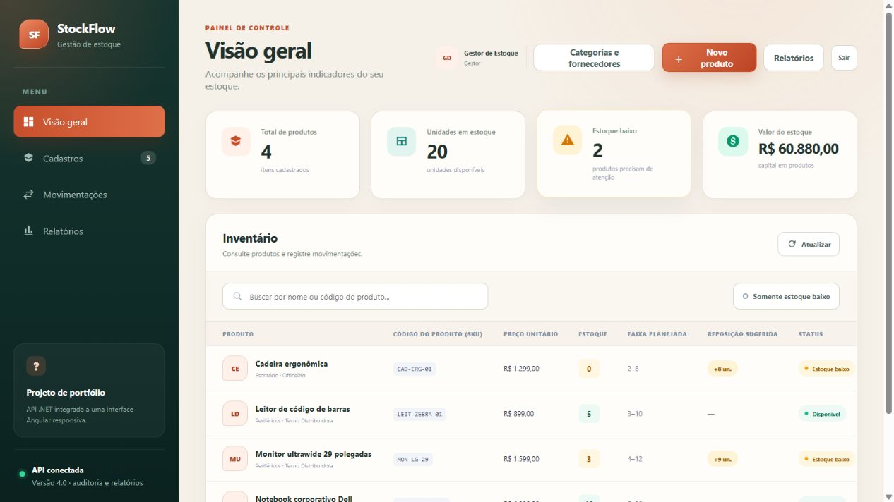
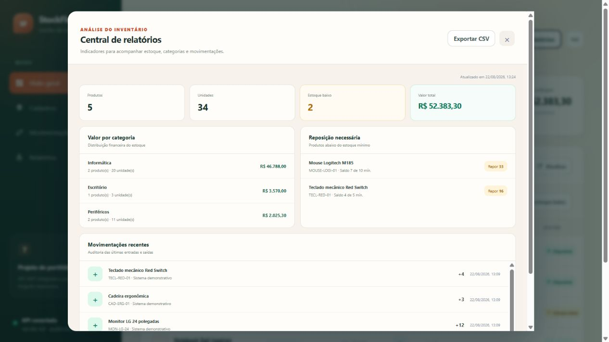
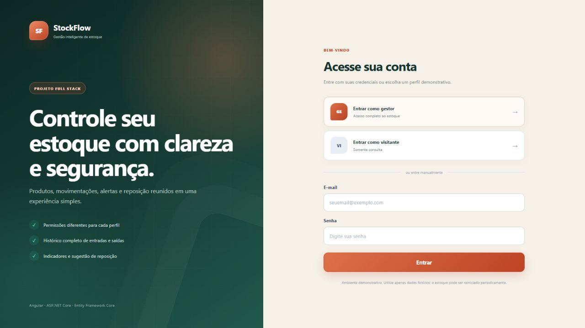

# StockFlow


[](https://github.com/SamuelMonsalvesMoreira/StockFlow/actions/workflows/ci.yml)
[](https://stockflow-samuel.onrender.com/)

Sistema full stack de controle de estoque construído com Angular, C# e ASP.NET Core. A aplicação possui login, controle de acesso por perfil, gerenciamento de produtos, categorias, fornecedores, entradas, saídas, reposição, auditoria e relatórios em uma interface responsiva.

## Demonstração online — um clique

### [Abrir a demonstração do StockFlow](https://stockflow-samuel.onrender.com/)

Não é necessário instalar ou configurar nada. Na tela de entrada, escolha **Acessar como Gestor** para testar cadastros e movimentações ou **Acessar como Visitante** para avaliar o modo somente leitura.

O Angular e a API ASP.NET Core são publicados no mesmo serviço e no mesmo endereço. Isso mantém a autenticação por cookie no mesmo domínio e simplifica a execução da demonstração.

O serviço gratuito pode levar alguns segundos para iniciar após um período sem acessos. As alterações feitas na versão online podem ser reiniciadas junto com o serviço.

## Demonstração visual

### Painel do gestor



### Relatórios e auditoria



<details>
<summary>Ver tela de login</summary>



</details>

## Visão técnica

| Área | Implementação |
|---|---|
| Back-end | C#, .NET 10 e ASP.NET Core Web API |
| Front-end | Angular 22 e TypeScript |
| Segurança | Cookie HttpOnly e autorização Viewer/Manager |
| Dados | Memória ou Entity Framework Core com SQL Server |
| Qualidade | 15 testes com xUnit e GitHub Actions |
| Publicação | Docker, Docker Compose e Render Blueprint |

## Objetivo

Demonstrar regras de negócio e arquitetura comuns em sistemas comerciais: autenticação, autorização por perfil, SKU único, movimentações auditáveis, bloqueio de estoque negativo, persistência substituível, tratamento padronizado de erros e testes automatizados.

## Principais recursos

- Tela única de login com acessos demonstrativos
- Perfil `Viewer`: consulta dashboard, produtos e históricos
- Perfil `Manager`: consulta e também cadastra, edita e movimenta o estoque
- Autorização aplicada na API, além da adaptação dos botões na interface
- Sessão em cookie `HttpOnly` com política `SameSite=Strict`
- Senhas validadas por hash no servidor

- Cadastro de produtos
- Edição de produtos sem alterar o código, o saldo ou o histórico
- Categorias e fornecedores vinculados aos produtos
- Estoques mínimo e máximo com sugestão automática de reposição
- Busca por nome ou código do produto (SKU)
- Filtro de produtos com estoque baixo
- Entrada e saída de estoque
- Bloqueio de saída superior ao saldo disponível
- Histórico de movimentações
- Identificação automática do responsável por cada entrada ou saída
- Dashboard com produtos, unidades, alertas e valor do estoque
- Central de relatórios com visão por categoria, reposição e movimentações recentes
- Exportação do inventário em CSV compatível com Excel
- Interface Angular responsiva para desktop e celular, com identidade visual própria inspirada em estoque e logística
- Formulários com validação e mensagens de sucesso ou erro
- Atualização automática do dashboard após cada operação
- Respostas de erro no padrão Problem Details
- Repositório em memória para execução imediata
- Implementação alternativa com Entity Framework Core e SQL Server
- Docker Compose com front-end, API, SQL Server e volumes persistentes
- Migrations do Entity Framework Core aplicadas automaticamente no modo SQL Server
- Quinze testes automatizados com xUnit
- Integração contínua no GitHub Actions para compilar e testar back-end, front-end e a imagem utilizada pelo Render

A reposição sugerida aparece quando o saldo é menor ou igual ao estoque mínimo. A quantidade é calculada por `estoque máximo - saldo atual`, evitando uma decisão de compra baseada apenas em um alerta genérico.

## Arquitetura

```text
Navegador
    |
Angular                  interface e validações de formulário
    |
HTTP / JSON + cookie de sessão
    |
Controllers
    |-- autorização Viewer / Manager
    |
InventoryService        regras e casos de uso
ReportService           consolidação dos indicadores e exportação
    |
IInventoryRepository    abstração de persistência
    |-- MemoryInventoryRepository
    `-- EfInventoryRepository --> Entity Framework Core --> SQL Server
```

Os controllers não conhecem o banco de dados. A configuração `StorageProvider` escolhe entre `Memory` e `SqlServer` durante a inicialização.

### Publicação no Render

```text
Navegador
    |
    | mesmo domínio: interface + /api
    v
Contêiner StockFlow
    |-- arquivos estáticos do Angular
    `-- ASP.NET Core Web API
            `-- MemoryInventoryRepository + dados fictícios iniciais
```

O `Dockerfile` possui estágios independentes para compilar Angular e .NET. A imagem final contém somente a aplicação ASP.NET Core publicada e os arquivos estáticos gerados pelo front-end. O arquivo `render.yaml` descreve o serviço, a verificação de saúde e as configurações seguras da demonstração.

## Como a API e o SQL Server trabalham juntos

A API recebe as ações do front-end, valida as regras do estoque e devolve respostas em JSON. O SQL Server é responsável por guardar produtos e movimentações de forma permanente.

| Modo | Uso | Persistência |
|---|---|---|
| `Memory` | Desenvolvimento rápido, demonstração e testes | Os dados são apagados quando a API é encerrada |
| `SqlServer` | Uso completo com Docker | Os dados permanecem no volume do banco |

O `IInventoryRepository` permite trocar o modo de armazenamento sem alterar os controllers ou as regras de negócio.

## Auditoria e relatórios

Ao registrar uma entrada ou saída, a API obtém o nome e o e-mail da sessão autenticada. O front-end não escolhe o responsável, evitando que uma pessoa atribua a operação a outro usuário. Essas informações ficam ligadas à movimentação e aparecem no histórico e no relatório.

A central de relatórios reúne valor do estoque por categoria, produtos que precisam de reposição e movimentações recentes. A exportação CSV é gerada pela API com os dados atuais e pode ser aberta no Excel. No modo `Memory`, o arquivo reflete somente a sessão atual; no modo `SqlServer`, reflete os dados persistidos no banco.

## Tecnologias

- C# e .NET 10
- ASP.NET Core Web API
- Entity Framework Core
- Microsoft SQL Server
- xUnit
- Docker e Docker Compose
- Angular 22
- TypeScript
- HTML e CSS responsivo

## Acessos de demonstração

| Perfil | E-mail | Senha | Permissão |
|---|---|---|---|
| Gestor | `gestor@stockflow.local` | `Gestor123!` | Consulta e alteração |
| Visitante | `visitante@stockflow.local` | `Visitante123!` | Somente consulta |

As contas acima são usadas somente no ambiente de demonstração.

No ambiente online, cinco produtos, três categorias e dois fornecedores fictícios são carregados automaticamente para que dashboard, alertas, histórico e relatórios possam ser avaliados imediatamente.

## Executar localmente

Requisitos: [.NET 10 SDK](https://dotnet.microsoft.com/download) e [Node.js](https://nodejs.org/).

### Windows — iniciar com dois cliques

Depois de baixar ou clonar o repositório, abra a pasta do projeto e execute `start-stockflow.cmd`. O arquivo prepara o Angular, inicia a API e abre `http://localhost:5081` automaticamente.

Mantenha a janela aberta enquanto estiver testando. Para encerrar, pressione `Ctrl+C`.

### Iniciar manualmente com um comando

Na raiz do repositório:

```powershell
dotnet run --project src/StockFlow.Api
```

Esse único comando instala as dependências do Angular na primeira execução, compila a interface, inicia a API e abre `http://localhost:5081`. A interface e a API funcionam no mesmo endereço, como na versão publicada no Render.

### Desenvolvimento com atualização automática

Para trabalhar no front-end com atualização automática, também é possível iniciar os projetos separadamente. No primeiro terminal, execute:

```powershell
dotnet run --project src/StockFlow.Api -p:SkipFrontendBuild=true
```

No segundo terminal:

```powershell
cd frontend
npm install
npm start
```

Nesse modo alternativo, abra `http://127.0.0.1:4200`. A API ficará em `http://localhost:5081`. Com armazenamento em memória, os dados são reiniciados quando a API é encerrada.

## Executar com SQL Server e Docker

1. Copie `.env.example` para `.env`.
2. Defina uma senha forte em `MSSQL_SA_PASSWORD`.
3. Execute:

```powershell
docker compose up --build
```

Abra `http://localhost:4200`. Nesse modo, o front-end acessa a API pela rede interna do Docker, a API aplica as migrations automaticamente e o SQL Server preserva o banco no volume `sqlserver-data` entre reinicializações.

Essa configuração é opcional e executada somente por quem iniciar os containers. Ela não transforma o computador do desenvolvedor em uma hospedagem pública; para uma demonstração online, a aplicação deve ser publicada em um serviço de nuvem.

Para encerrar sem apagar os dados:

```powershell
docker compose down
```

O arquivo `.env` contém a senha local do banco e não deve ser enviado ao GitHub. Apenas o modelo seguro `.env.example` faz parte do repositório.

## Migrations do banco de dados

As migrations registram a evolução da estrutura do SQL Server no próprio código. A aplicação as aplica automaticamente ao iniciar no modo `SqlServer`. Para administrar as migrations manualmente durante o desenvolvimento:

```powershell
dotnet tool restore
dotnet ef database update --project src/StockFlow.Api
```

## Endpoints principais

| Método | Endpoint | Função |
|---|---|---|
| `GET` | `/health` | Verifica se a API está ativa |
| `POST` | `/api/auth/login` | Inicia uma sessão |
| `GET` | `/api/auth/me` | Retorna o usuário autenticado |
| `POST` | `/api/auth/logout` | Encerra a sessão |
| `GET` | `/api/products` | Lista, busca e filtra produtos |
| `GET` | `/api/products/{id}` | Consulta um produto |
| `POST` | `/api/products` | Cadastra um produto |
| `PUT` | `/api/products/{id}` | Edita os dados de um produto |
| `GET` | `/api/products/{id}/movements` | Lista movimentações |
| `POST` | `/api/products/{id}/movements` | Registra entrada ou saída |
| `GET` / `POST` | `/api/categories` | Lista e cadastra categorias |
| `GET` / `POST` | `/api/suppliers` | Lista e cadastra fornecedores |
| `GET` | `/api/dashboard/summary` | Retorna indicadores do estoque |
| `GET` | `/api/reports/overview` | Retorna a visão consolidada dos relatórios |
| `GET` | `/api/reports/inventory.csv` | Exporta o inventário em CSV |

## Exemplo de produto

```json
{
  "sku": "NOTE-DELL-01",
  "name": "Notebook Dell",
  "unitPrice": 4500.00,
  "minimumStock": 3,
  "maximumStock": 15,
  "categoryId": 1,
  "supplierId": 1
}
```

## Exemplo de entrada

```json
{
  "type": "Entry",
  "quantity": 10,
  "note": "Compra inicial"
}
```

## Testes

```powershell
dotnet test
```

Para verificar a compilação do front-end:

```powershell
cd frontend
npm run build
```

Os testes verificam login dos dois perfis, rejeição de senha incorreta, hash de senha, validação em ambiente português, normalização e duplicidade de SKU, cálculo de entradas e saídas, bloqueio de saldo negativo, edição com preservação do saldo, sugestão de reposição, categorias, indicadores do dashboard, responsável pela movimentação, resumo dos relatórios, exportação CSV e carga idempotente dos dados demonstrativos.

Além dos testes automatizados, a autorização foi verificada pela API: uma requisição sem sessão retorna `401 Unauthorized` e uma tentativa de escrita feita pelo visitante retorna `403 Forbidden`.

## Integração contínua

O workflow de CI executa automaticamente em alterações e pull requests para a branch `main`. Ele restaura, compila e testa a API em .NET, instala e testa o Angular, gera o build de produção e valida a construção da mesma imagem Docker utilizada pelo Render. Assim, o selo no início deste README mostra se a versão publicada passou pelas verificações automatizadas.

## Roadmap

- [x] API de produtos e movimentações
- [x] Regras de estoque
- [x] Testes unitários
- [x] Implementação para SQL Server
- [x] Docker Compose preparado
- [x] Front-end Angular responsivo
- [x] Integração do Angular com a API
- [x] Categorias e fornecedores
- [x] Edição de produtos
- [x] Sugestão automática de reposição
- [x] Login e logout
- [x] Perfis de visitante e gestor
- [x] Proteção das operações na API
- [x] Auditoria do responsável pelas movimentações
- [x] Central de relatórios
- [x] Exportação CSV compatível com Excel
- [x] Migrations do Entity Framework Core
- [x] Front-end, API e SQL Server no Docker Compose
- [x] GitHub Actions para back-end e front-end
- [x] Capturas reais da aplicação no README
- [x] Blueprint e imagem única preparados para demonstração no Render
- [ ] Validar a execução completa dos containers em um ambiente com virtualização habilitada
- [x] Concluir a primeira publicação da demonstração online
- [ ] Substituir as contas demonstrativas por cadastro de usuários com ASP.NET Core Identity ou provedor externo
- [ ] Proteger as chaves de sessão com certificado ou cofre de chaves no ambiente de produção
- [ ] Adicionar filtros, ordenação e paginação
- [ ] Permitir inativar produtos sem apagar o histórico


